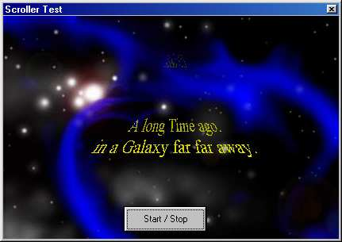

<div align="center">

## Starwars Scroller V2\.1


</div>

### Description

A transparent Starwars Scroller Control for About dialogs... U can load the Scrolltext from a File or crete it as string.You can change: Font, Scollspeed, Size... There is an Speedtest so it will sroll with the same speed on any PC....
 
### More Info
 


<span>             |<span>
---                |---
**Submitted On**   |2002-01-05 18:34:16
**By**             |[Scythe](https://github.com/Planet-Source-Code/PSCIndex/blob/master/ByAuthor/scythe.md)
**Level**          |Intermediate
**User Rating**    |4.9 (54 globes from 11 users)
**Compatibility**  |VB 5\.0, VB 6\.0
**Category**       |[Graphics](https://github.com/Planet-Source-Code/PSCIndex/blob/master/ByCategory/graphics__1-46.md)
**World**          |[Visual Basic](https://github.com/Planet-Source-Code/PSCIndex/blob/master/ByWorld/visual-basic.md)
**Archive File**   |[Starwars\_S154108282003\.zip](https://github.com/Planet-Source-Code/scythe-starwars-scroller-v2-1__1-43041/archive/master.zip)

### API Declarations

```
Declare Function BitBlt Lib "gdi32" (ByVal hdcDest As Long, ByVal XDest As Long, ByVal YDest As Long, ByVal nWidth As Long, ByVal nHeight As Long, ByVal hDCSrc As Long, ByVal XSrc As Long, ByVal YSrc As Long, ByVal dwRop As Long) As Long
Declare Function GetTickCount Lib "kernel32" () As Long
Declare Function TextOut Lib "gdi32.dll" Alias "TextOutA" (ByVal hdc As Long, ByVal x As Long, ByVal y As Long, ByVal lpString As String, ByVal nCount As Long) As Long
Declare Function GetDIBits Lib "gdi32" (ByVal aHDC As Long, ByVal hBitmap As Long, ByVal nStartScan As Long, ByVal nNumScans As Long, lpBits As Any, lpBI As BITMAPINFO, ByVal wUsage As Long) As Long
Declare Function SetDIBits Lib "gdi32" (ByVal hdc As Long, ByVal hBitmap As Long, ByVal nStartScan As Long, ByVal nNumScans As Long, lpBits As Any, lpBI As BITMAPINFO, ByVal wUsage As Long) As Long
Declare Function GetDriveType Lib "kernel32" Alias "GetDriveTypeA" (ByVal nDrive As String) As Long
```


